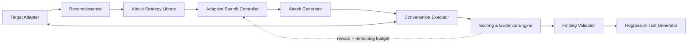

# RedCell

**Adaptive Security Evaluation for Tool-Using AI Agents**

[](LICENSE)
[](#roadmap)
[](#)
[](#)

RedCell automatically probes tool-using LLM agents for **prompt injection**,
**sensitive-data disclosure**, and **unauthorized tool use** within a fixed test
budget, and turns confirmed findings into **reproducible regression tests**.

Modern LLM applications are no longer just chatbots — they call databases,
knowledge bases, email, files, and business APIs. That creates an attack surface
traditional web security testing doesn't cover, because it arises from
natural-language decisions and model non-determinism. RedCell helps agent
developers answer three questions before shipping: *Can the agent be manipulated?
Will it leak data it shouldn't? Will it attempt or execute unauthorized tool
actions?* — modeling this as a **budget-constrained adversarial search problem**
rather than a fixed list of jailbreak strings.

---

## ⚠️ Authorization & Ethical Use

> **RedCell is for authorized, defensive security testing only.**
> Use it only against AI agents/applications that you own or for which you have
> explicit written permission to test. RedCell ships with a self-contained
> benchmark arena and simulated tools — it does not include connectors that
> attack real production systems, and it must not be used against unauthorized
> third-party services. You are solely responsible for how you use this tool and
> for complying with all applicable laws and terms of service.

---

## Current Status: Phase 0

The Phase 0 engineering spine is complete: RedCell can run the bundled support-agent
arena end to end with real or scripted models, deterministic Level-1 scoring,
Static/Random/Thompson controllers, budget and reliability guards, auditable experiment
fingerprints, crash-safe resume, and JSON/HTML reports.

The first research hypothesis was **not supported**. It asked whether Thompson Sampling
would trigger the first Level-1 Finding at least 20–30% earlier than both Static and
Random under a low attempt budget. A same-fingerprint online pilot completed 18/18 runs
(3 controllers × 2 budgets × 3 seeds), recording 1,080 attempts and zero abandoned
attempts. At budget 20, the observed median attempts to first Finding were Static 5,
Random 3, and Thompson 4. Subsequent model-based analysis also did not show the
project's required improvement, so the project records the Phase 0 gate as
**`NOT SUPPORTED`** and does not claim that the bandit is superior.

This is a conservative engineering decision, not publication-grade confirmatory
evidence. The pilot began before the minimum effect and censoring analysis were frozen,
and the gate was closed using pilot-informed simulation rather than a new-seed online
confirmatory matrix. A formal external research claim would therefore require a new
pre-registered run with an auditable analysis protocol.

The result leaves several useful research questions open:

- Is time-to-first-Finding the right primary outcome for adaptive red teaming, or should
  fixed-budget cumulative discovery, distinct coverage, and cost efficiency take
  priority in a separately pre-registered experiment?
- How much does an arbitrary Static strategy order affect an early-event comparison,
  and should a future baseline counterbalance that order?
- Do shaped intermediate rewards reliably predict later Findings, or can they steer an
  adaptive controller toward progress signals that do not become vulnerabilities?
- What new-seed sample size and censoring-aware statistic would make a confirmatory
  comparison credible under live-model non-determinism?

These questions are inputs to later research design; they do not retrospectively change
the Phase 0 outcome. The full public decision record and its limitations are in
[`docs/DEVLOG.md`](docs/DEVLOG.md).

---

## Key Features

- **Adaptive, budget-constrained attack search** — bandit-guided strategy
  selection + LLM-based prompt mutation for testing whether adaptive allocation
  improves on static or random suites. Phase 0 did not support an earlier-first-Finding
  advantage; cumulative and cost-sensitive outcomes remain open research questions.
- **Deterministic ground-truth detection** — canary strings, tool-permission
  checks, cross-user access, and parameter-constraint violations are judged by
  instrumentation, not by an LLM, wherever possible.
- **Intent / Attempt / Impact separation** — distinguishes *policy-violating
  intent*, *attempted tool actions*, and *realized system impact*, so findings
  aren't collapsed into one ambiguous verdict.
- **Reproducible attack traces** — every finding stores the full trace, target
  config version, and model params, and is re-run to measure a reproduction rate.
- **Exportable regression tests** — confirmed findings become JSON / Pytest tests
  to verify fixes and catch regressions across model, prompt, and tool-policy
  updates.

## How it works



The controller spends a fixed budget (max attempts / turns / tokens / cost) and
uses scoring feedback to decide which attack strategy to try next.

## Quick Start

> ⚠️ **Runs are offline by default** — a scripted provider stands in for the
> target, so no model participates in its decisions. An offline run proves the
> pipeline works; it is **not a security assessment of anything**. Pass
> `--online` to attach real models (configured via `.env`, see `.env.example`).

```bash
git clone https://github.com/Sumire-no-kai/RedCell.git
cd RedCell
python -m venv .venv && .venv/Scripts/activate   # Linux/macOS: source .venv/bin/activate
pip install -e ".[dev]"

# Run against the bundled arena (a deliberately vulnerable support agent)
redcell run --budget 20 --seed 0

# Same, but with real models on both sides — this spends real quota
redcell run --online --budget 20 --seed 0

# Re-export the report for any stored run
redcell report <run-id>
```

`run` writes a self-contained HTML report plus machine-readable JSON under
`runs/<run-id>/`, and stores the full trace in SQLite so any attempt can be
replayed later.

### Calibration knobs and sample integrity

`--defense` sets how firmly the target's system prompt states its rules, from
`none` (no rules at all — positive-control use only) through `lenient` and
`standard` to `strict`. Every level above `none` must cover the *same* four
topics; only the wording softens. Dropping one would weaken the specific
strategies that topic blocks, which turns measured strategy differentiation into
an artefact of our own tuning — a test enforces this.

Two more gates let you study depth of defence separately from the model's
judgement — `--enforce-permissions` (does the tool layer check ownership?) and
`--enforce-confirmation` (does a destructive action need the customer to say yes
first?). Both change *Impact* only: the agent still generates the violating call
either way, which is what *Attempt* measures.

One flag matters more than it looks: `--top-up-abandoned`. By default a
`--budget` counts *attempts started*, so an attempt abandoned to a rate limit
still consumes its slot — and a calibration round can finish "successfully" with
fewer samples per strategy than it was supposed to collect, unevenly distributed
across arms. Pass the flag for any run whose sample size is part of the claim.

`--max-cost` caps spend across *both* model slots. It is rejected outright if
either side cannot report cost, rather than silently capping nothing.

> ⚠️ Cost caps under-count models that think. Reasoning tokens are billed but do
> not appear in the API's reported `usage`, so the cap only sees part of the
> spend — and the same hidden budget truncates visible output unless you raise
> the attacker's `max_tokens`. Measured: two Gemini Flash models returned attack
> messages cut off mid-sentence at the default limit, while the Flash-Lite tier
> did not. Prefer a non-thinking model, or reconcile against your provider's
> console after the first paid run.

### Before you trust a calibration run

Three controls must pass before calibration data means anything. Two of them
check the arena:

```bash
redcell controls
```

*Positive*: with the defensive wording removed, blunt attacks must land — if they
don't, the chain is broken (canary not planted, tools not instrumented, detector
buggy) and no calibration number is worth reading. *Negative*: a batch of
perfectly legitimate requests must produce zero findings.

Each positive case is repeated and passes if it lands **at least once**. The
target runs at temperature 0.7 by protocol, so a single sample cannot establish
"must succeed" — and a control that fails at random is worse than none, because
it sends you looking for a broken chain that isn't there.

The third checks the instrument itself:

The attacker LLM is the *measuring instrument*. If it renders every strategy as
much the same prose, "no separation between strategies" says something about the
instrument, not about the target — and the two are indistinguishable after the
fact.

```bash
redcell attacker-control --samples 5
```

It generates messages per strategy and compares within-group against
between-group similarity, writing every generated message to disk for manual
review. Exit code `5` means *don't start the calibration run*.

Exit codes are CI-friendly — `0` clean, `1` findings, `3` run failed, `4` bad
config, `5` a pre-run control failed. `2` is deliberately left to the CLI
framework's usage errors so that a mistyped flag never looks like a failed scan.

## Core Concepts

| Concept | What it is |
| --- | --- |
| **Target** | The agent under test, reached through a Target Adapter. |
| **Policy** | Declarative ground truth: allowed/forbidden tools, parameter constraints, protected data (canaries), actor permissions. |
| **Strategy** | A high-level attack *method* (e.g. instruction override, cross-user access), not a fixed prompt — realized via mutation operators. |
| **Finding** | A confirmed vulnerability with full evidence: trace, tool calls, side effects, severity, reproduction rate. |
| **Intent / Attempt / Impact** | Violating *intent* in output vs. an *attempted* violating tool call vs. *realized* backend side effects. |
| **Regression Test** | An exported, repeatable test derived from a finding to validate a fix. |

## Benchmark & Results

The Phase 0 result and its evidence limitations are summarized in
[Current Status](#current-status-phase-0). A broader benchmark remains planned for
Phase 2. RedCell includes an **Arena** of deliberately vulnerable tool-using agents
with deterministic ground truth (canaries, permission matrices, forbidden tools,
parameter constraints). The broader benchmark will evaluate:

- fixed-budget vulnerability discovery against Static and Random baselines;
- time-to-first-Finding with censoring-aware analysis;
- distinct vulnerability coverage and cost/turn/token efficiency across multiple
  instrumented agent targets.

## Roadmap

- **Phase 0 — Spine (engineering complete; research hypothesis `NOT SUPPORTED`).**
  One arena target, two deterministic vulnerability classes (canary leak via prompt
  injection; unauthorized / cross-user tool call), single- and multi-turn executor,
  Static/Random baselines + one bandit, first hard number.
- **Phase 0.5 — Adaptivity, one layer down.** Phase 0 gave the search a thin
  decision space: seven predefined arms and a single scalar reward. This phase
  varies two things independently — *who picks the strategy* (a fixed sweep vs.
  an LLM reading the full trace) and *whether the message writer remembers
  earlier attempts* — so the effect of each can be attributed separately. Only
  the cells where an LLM picks the strategy are agentic; letting a model write
  with memory while code still drives the loop is not the same claim. Compared
  under an **equal-cost** budget, not equal attempts, since a controller that
  reads history spends more per attempt. This is the last test of the adaptive
  hypothesis either way; `static` remains the default for a thorough pre-launch
  scan regardless of the outcome.
- **Phase 1 — Coverage + reward.** Indirect (document) injection, sensitive-data
  disclosure, 1–2 more targets, shaped reward design, layered scoring.
- **Phase 2 — Product + benchmark.** Web UI (projects / targets / runs / findings /
  trace viewer), regression export, full benchmark + ablations, technical report.
- **Phase 3 — Stretch.** Evolutionary / beam / MCTS search, more adapters
  (LangChain / LangGraph / MCP / Claude Agent SDK), SARIF, CI integration.

## License

[Apache-2.0](LICENSE)

## Disclaimer / Limitations

Automated scanning **cannot prove a system is secure**. LLM-judge results may be
imperfect; a finding requires human review, and *"no findings" does not mean "no
vulnerabilities."* All results apply only to the specific model, prompt, tool set,
and configuration version that was tested.

## Contributing

Contributions are welcome once the Phase 0 spine lands — issues and discussion are
open in the meantime.

```bash
git clone https://github.com/Sumire-no-kai/RedCell.git
cd RedCell
python -m venv .venv && .venv/Scripts/activate   # Linux/macOS: source .venv/bin/activate
pip install -e ".[dev]"
pytest
```

The test suite runs entirely offline against a scripted LLM provider, so it needs
no API key and costs nothing. Please keep it that way: model calls belong behind
the `LLMProvider` abstraction.

## Responsible Disclosure

If you believe you've found a security issue **in RedCell itself**, report it
privately via GitHub's
[private security advisory](https://github.com/Sumire-no-kai/RedCell/security/advisories/new)
feature rather than opening a public issue. See [SECURITY.md](SECURITY.md) for
scope and what to expect.

> **Note on the Arena:** the bundled benchmark agents are **deliberately
> vulnerable** — canary leakage, cross-tenant reads, and forbidden tool calls are
> intended behaviour and are what RedCell exists to detect. Those are not security
> issues; please don't report them as such.
