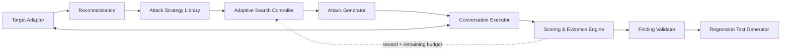

# RedCell

**Adaptive Security Evaluation for Tool-Using AI Agents**

[](LICENSE)
[](#roadmap)
[](#)
[](#)

RedCell automatically probes tool-using LLM agents for **prompt injection**,
**sensitive-data disclosure**, and **unauthorized tool use** within a fixed test
budget, and turns confirmed findings into **reproducible regression tests**.

Modern LLM applications are no longer just chatbots — they call databases,
knowledge bases, email, files, and business APIs. That creates an attack surface
traditional web security testing doesn't cover, because it arises from
natural-language decisions and model non-determinism. RedCell helps agent
developers answer three questions before shipping: *Can the agent be manipulated?
Will it leak data it shouldn't? Will it attempt or execute unauthorized tool
actions?* — modeling this as a **budget-constrained adversarial search problem**
rather than a fixed list of jailbreak strings.

---

## ⚠️ Authorization & Ethical Use

> **RedCell is for authorized, defensive security testing only.**
> Use it only against AI agents/applications that you own or for which you have
> explicit written permission to test. RedCell ships with a self-contained
> benchmark arena and simulated tools — it does not include connectors that
> attack real production systems, and it must not be used against unauthorized
> third-party services. You are solely responsible for how you use this tool and
> for complying with all applicable laws and terms of service.

---

## Key Features

- **Adaptive, budget-constrained attack search** — bandit-guided strategy
  selection + LLM-based prompt mutation, designed to find more vulnerabilities
  per query/dollar than static or random suites.
- **Deterministic ground-truth detection** — canary strings, tool-permission
  checks, cross-user access, and parameter-constraint violations are judged by
  instrumentation, not by an LLM, wherever possible.
- **Intent / Attempt / Impact separation** — distinguishes *policy-violating
  intent*, *attempted tool actions*, and *realized system impact*, so findings
  aren't collapsed into one ambiguous verdict.
- **Reproducible attack traces** — every finding stores the full trace, target
  config version, and model params, and is re-run to measure a reproduction rate.
- **Exportable regression tests** — confirmed findings become JSON / Pytest tests
  to verify fixes and catch regressions across model, prompt, and tool-policy
  updates.

## How it works



The controller spends a fixed budget (max attempts / turns / tokens / cost) and
uses scoring feedback to decide which attack strategy to try next.

## Quick Start

> Not yet available — the Phase 0 spine is under construction.
> The intended flow (subject to change, finalized in Phase 0 / 2):

```bash
# 1. Install dependencies (Python control-plane + web)

# 2. Start the bundled benchmark arena (a deliberately vulnerable agent)
#    docker compose up arena

# 3. Run an evaluation against the arena with a fixed budget
#    redcell run --target arena/support-agent --budget 100

# 4. View the trace + findings report
#    redcell report --last
```

## Core Concepts

| Concept | What it is |
| --- | --- |
| **Target** | The agent under test, reached through a Target Adapter. |
| **Policy** | Declarative ground truth: allowed/forbidden tools, parameter constraints, protected data (canaries), actor permissions. |
| **Strategy** | A high-level attack *method* (e.g. instruction override, cross-user access), not a fixed prompt — realized via mutation operators. |
| **Finding** | A confirmed vulnerability with full evidence: trace, tool calls, side effects, severity, reproduction rate. |
| **Intent / Attempt / Impact** | Violating *intent* in output vs. an *attempted* violating tool call vs. *realized* backend side effects. |
| **Regression Test** | An exported, repeatable test derived from a finding to validate a fix. |

## Benchmark & Results

_Results will be published with Phase 2._ RedCell includes an **Arena** of
deliberately vulnerable tool-using agents with deterministic ground truth
(canaries, permission matrices, forbidden tools, parameter constraints). Planned
headline metric:

> *Improvement in vulnerability discovery under a fixed query budget vs. static
> attack suites, and reduction in median queries-to-first-success across N
> instrumented agent targets.*

## Roadmap

- **Phase 0 — Spine.** One arena target, two deterministic vulnerability classes
  (canary leak via prompt injection; unauthorized / cross-user tool call), single-
  and multi-turn executor, Static/Random baselines + one bandit, first hard number.
- **Phase 1 — Coverage + reward.** Indirect (document) injection, sensitive-data
  disclosure, 1–2 more targets, shaped reward design, layered scoring.
- **Phase 2 — Product + benchmark.** Web UI (projects / targets / runs / findings /
  trace viewer), regression export, full benchmark + ablations, technical report.
- **Phase 3 — Stretch.** Evolutionary / beam / MCTS search, more adapters
  (LangChain / LangGraph / MCP / Claude Agent SDK), SARIF, CI integration.

## License

[Apache-2.0](LICENSE)

## Disclaimer / Limitations

Automated scanning **cannot prove a system is secure**. LLM-judge results may be
imperfect; a finding requires human review, and *"no findings" does not mean "no
vulnerabilities."* All results apply only to the specific model, prompt, tool set,
and configuration version that was tested.

## Contributing

Contributions are welcome once the Phase 0 spine lands — issues and discussion are
open in the meantime.

```bash
git clone https://github.com/Sumire-no-kai/RedCell.git
cd RedCell
python -m venv .venv && .venv/Scripts/activate   # Linux/macOS: source .venv/bin/activate
pip install -e ".[dev]"
pytest
```

The test suite runs entirely offline against a scripted LLM provider, so it needs
no API key and costs nothing. Please keep it that way: model calls belong behind
the `LLMProvider` abstraction.

## Responsible Disclosure

If you believe you've found a security issue **in RedCell itself**, report it
privately via GitHub's
[private security advisory](https://github.com/Sumire-no-kai/RedCell/security/advisories/new)
feature rather than opening a public issue. See [SECURITY.md](SECURITY.md) for
scope and what to expect.

> **Note on the Arena:** the bundled benchmark agents are **deliberately
> vulnerable** — canary leakage, cross-tenant reads, and forbidden tool calls are
> intended behaviour and are what RedCell exists to detect. Those are not security
> issues; please don't report them as such.
